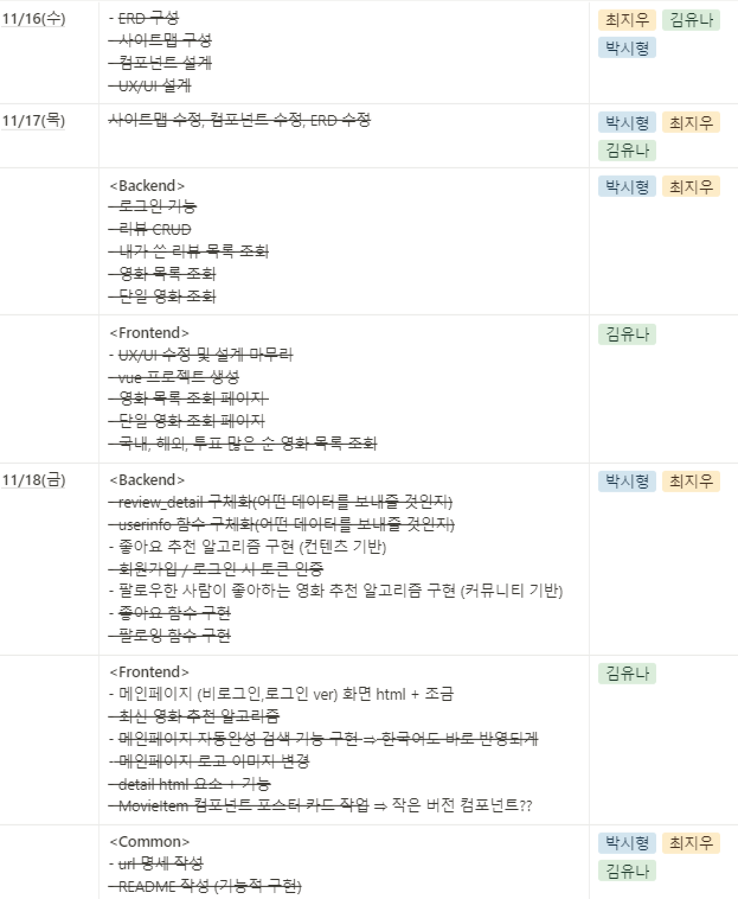
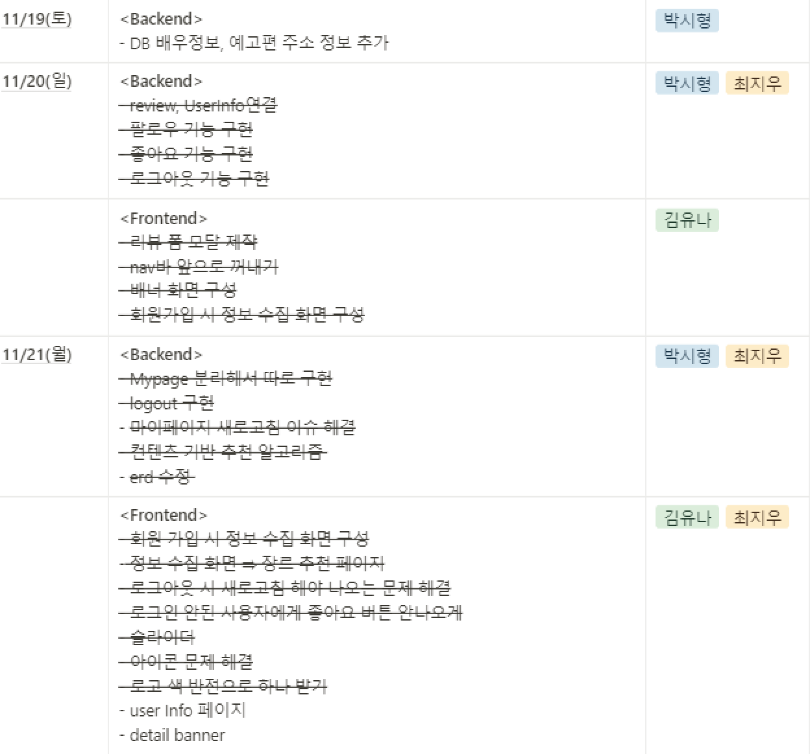
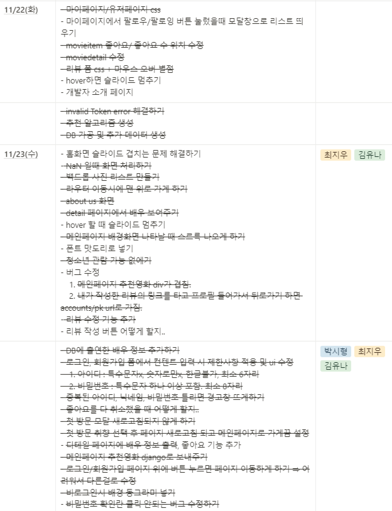
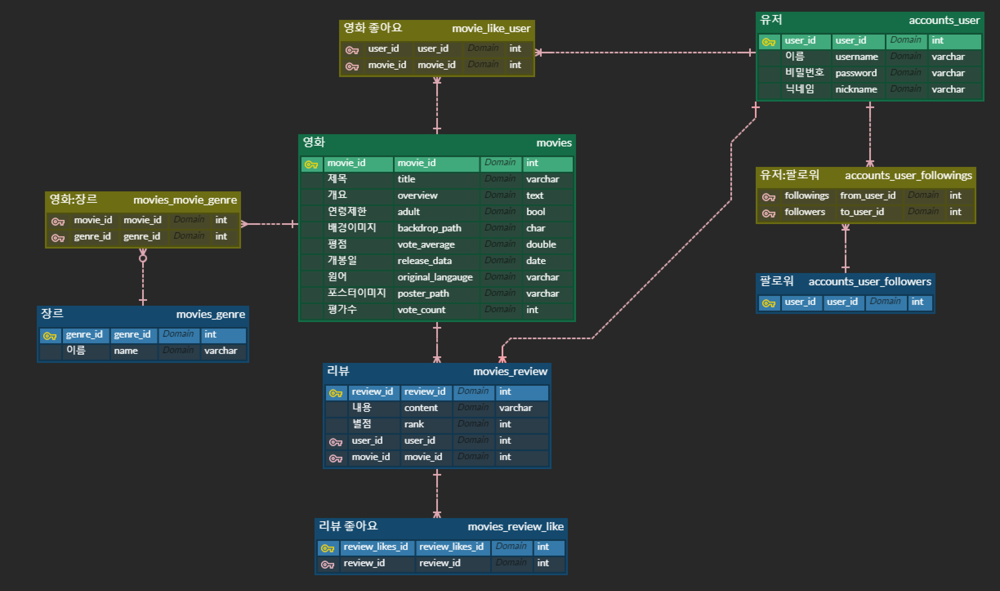
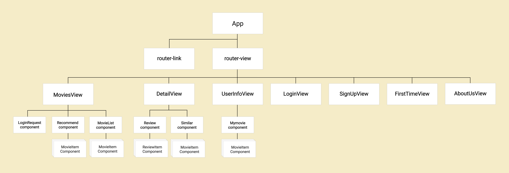
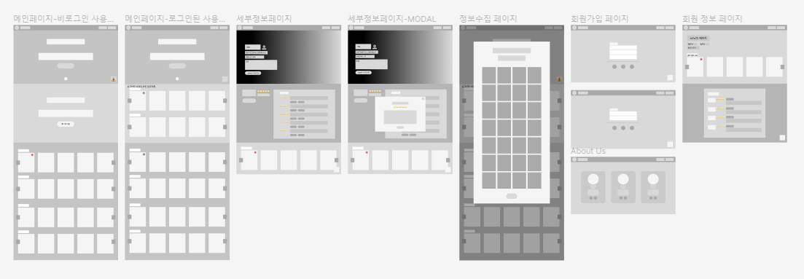
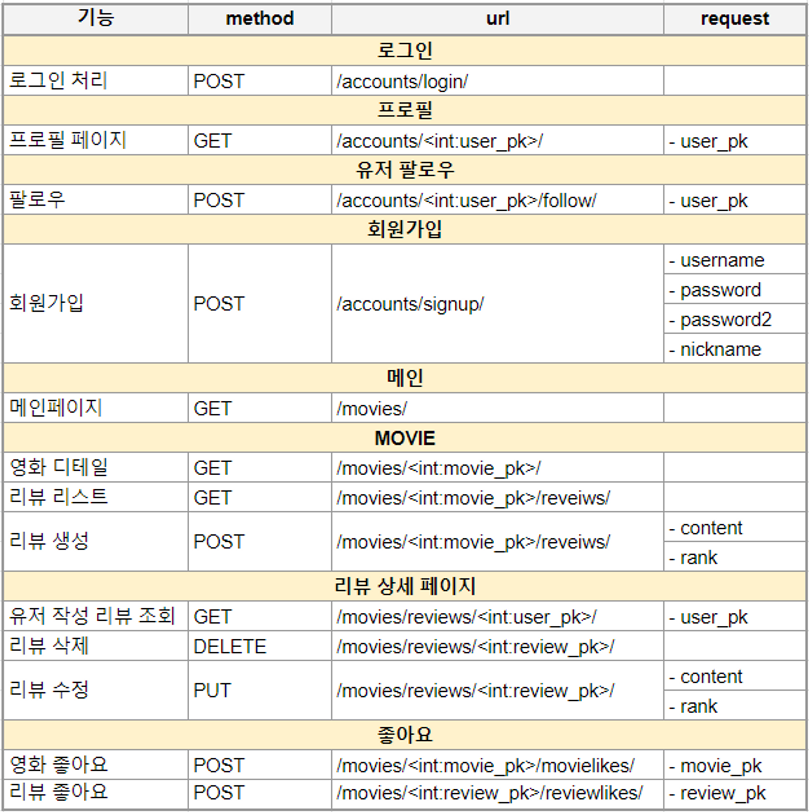

# 👨‍👧‍👧 Team : 최김박 프로젝트
<hr>
<br><br><br>

# MOVIE SPOTTER


<hr>

## 업무분담



<br>

### 📑최김박 프로젝트 노션 (https://www.notion.so/a-k-a-a5ea666ed3c948caaaaaf72b41db66ec)
<br>

## 목표 서비스 구현 및 실제 구현 정도

> 컨텐츠 기반 추천 알고리즘
- 사용자가 가입 시 선호하는 영화를 선택할 수 있게 함
- 사용자가 로그인 후 좋아요를 누른 영화의 장르 선호도(비율) 추출
=> 선호도와 비례한 양의 영화 추천
=> 사용자의 찜 목록 길이가 길어질 수록 추천 정확도가 높아질 것으로 예상
<br>

> 커뮤니티 기반 추천 알고리즘
- 사용자가 팔로우를 한 타 사용자의 찜 목록에 담긴 영화를 보여주는 방식
<br>

> 자동 완성 검색 기능
- 검색 키워드를 실시간으로 파악하여 검색어를 자동 완성해주는 기능
- 실시간으로 해당하는 영화 목록을 사용자에게 보여줌
<br>

## 🛠 데이터 베이스 모델링 (ERD)

<br>

## 🗺 사이트 맵

<br>

## 🎨 UX/UI 설계

<br>

## 💻URL 명세

<br>

## 서비스 기능

|      | 기능                                     | 기능설명                                                     |
| ---- | ---------------------------------------- | ----------------------------------------------------------- |
| 1    | 로그인 /회원가입                          | JWT 토큰을 통한 유저 회원가입 및 인증                       |
| 2    | 로그아웃                                 | localstorge에 저장한 JWT 토큰 삭제                          |
| 3    | 유저 팔로우                              | 유저간의 팔로우 및 팔로잉 기능 구현                          |
| 4    | 영화 좋아요 기능                         | 유저별 찜 목록을 리스트로 관리하여 데이터 구조를 최소화.       |
| 5    | 마이페이지 조회                          | 유저 정보, 유저가 특정 영화에 쓴 리뷰 목록, 좋아요한 영화 목록조회 |
| 6    | tmdb 자료 추출 및 DB화                   | tmdb API의 3300여개의 영화와 장르, 감독, 배우 DB화           |
| 7    | 좋아요 기반의 추천 영화 조회             | 유저가 좋아요한 영화와 같은 장르, 비슷한 투표수와 평점을 가지고 있는 영화 crusel로 추천 |
| 8    | 팔로워 기반의 추천 영화 조회             | 유저가 팔로우한 유저들 중에 유저와 가장 비슷한 팔로워가 좋아하는 영화 crusel로 추천 |
| 9    | 영화 디테일 페이지 조회                  | 세부 영화 정보, 예고편 팝업, 영화 리뷰, 비슷한 영화 추천      |
| 10   | 영화 비슷한 영화 조회                    | 평균 평점, 개봉일, 투표수가 비슷한 영화들로 추천             |
| 11   | 영화 검색                               | 영화 검색 시 자동완성 기능 구현                              |
| 12   | 영화 메인페이지 조회                     | 최신작, 많은 사람이 본 영화, 국내영화, 해외영화 top 20으로 20개씩 슬라이더로 구현 |
| 13   | 리뷰 생성 / 삭제                         | 특정 영화의 리뷰 생성 기능 및 수정, 삭제 구현                 |
| 14   | 리뷰 좋아요                             | 특정 리뷰가 도움이 돼요의 추가 및 삭제 기능 구현              |
| 15   | 필수 로그인 요소                        | JWT 토큰을 기반으로 필수 로그인 요소 안보이게 구현            |
| 16   | 회원가입 후 선호하는 영화                | 회원가입 후 모달창을 띄워 영화 고른 후 바로 영화 추천         |
| 17   | admin페이지                              | Django Admin 을 사용하여 유저, 영화, 리뷰에 대한 정보 제어할 수 있도록 기능 구현 |
<br>

## Overview

> 메인페이지

- 1페이지의 배경은 16개의 backdrop 이미지 중에 랜덤으로 출력. 로고 타이핑 효과, 자동완성 검색 기능
- 비로그인시 2페이지는 위의 페이지와 겹치지 않게 16개의 backdrop 이미지 중에 랜덤으로 출력. 로그인 버튼
- 로그인시 2페이지는 좋아요 기반 영화 추천 crusel, 좋아요가 없다면 인기있는 영화 중 랜덤 출력
- 로그인시 3페이지는 팔로워가 있을 때, 팔로워 기반 영화 추천 crusel
- 최신 영화, 인기 영화, 국내 영화, 해외 영화 순으로 출력
- 로그인 시 영화 카드 상단에 좋아요 클릭 버튼
<br>

> 영화 상세 페이지

- 1페이지에는 영화 제목, 개봉일, 장르, 요약, 예고편, 감독, 배우 정보 출력
- 예고편 링크 클릭 시 유튜브 팝업
- 2페이지에는 리뷰 관련 정보 출력
- 리뷰 평균 평점, 리뷰 작성 버튼(비로그인시 로그인로 가는 url), 리뷰 리스트(스크롤 구현)
- 리뷰 작성자 클릭 시 그 유저의 프로필 페이지로 넘어가서 팔로우 가능
- 리뷰 작성, 수정은 모달
- 3페이지에는 비슷한 영화 10개 추천
<br>

> 회원가입, 로그인 페이지

- 회원가입, 로그인 back/front card css로 구현
- 아이디는 영문, 숫자에 4-12자로 제한
- 패스워드는 영문, 숫자, 특수문자 필수 포함에 8-16자 제한
- 회원가입하면 자동 로그인 후 선호하는 영화 고르는 모달창
<br>

> 첫 로그인 시 영화 선택 모달

- 평균평점 내림차순, 투표수 8000이상인 영화 랜덤 30개 출력
- 하나도 선택하지 않으면 경고창, 모달 창 exit 불가능
- 영화 선택 후 제출하면, 바로 메인페이지에서 좋아요 기반 추천
<br>

> 유저 정보 페이지

- 팔로우, 팔로잉 숫자
- 내가 쓴 리뷰 스크롤 구현, 영화, 별점, 내용, 좋아요 수 출력
- 영화 클릭시 디테일 페이지로
<br>

## 영화 추천 알고리즘 (기술적 설명)

- 정렬을 위해 heapq 모듈로 힙 자료구조 사용
- 랜덤 선택을 위해 random 모듈의 shuffle 함수 사용
- 날짜의 년도 연산을 위해 relativedelta 함수 사용

- 팔로잉 유저 기반 추천 알고리즘
  - 서로 좋아요한 영화가 많이 겹칠수록, 취향이 비슷한, 유사한 유저라 판단.
  - 유사 팔로잉 유저가 누른 좋아요 중 내가 좋아요를 누르지 않은 영화를 추천.
  - 가장 유사한 유저부터 먼저 해당 영화를 추천.
  - 유사한 유저 정렬을 위해 (겹치는 영화의 수, [겹치지 않는 영화])로 튜플을 만들어 힙 자료구조에 사용.

```python
@api_view(['POST'])
def recommendbymyfollowings(request):
    # by followings
    me = get_object_or_404(get_user_model(), pk=request.data['user_id'])
    my_followings = me.followings.all()
    my_like_movies = me.like_movies.all()
    following_tier_movie_list = []

    # 팔로잉한 유저별
    for following in my_followings:
        same_cnt = 0                    # 좋아하는 영화가 겹치는 수
        not_same_movies = []            # 팔로잉 유저는 좋아요를 눌렀지만, 나는 좋아요를 누르지 않은 영화를 담는 리스트
        following_like_movies = following.like_movies.all()
        # 팔로잉 유저가 좋아요를 누른 영화들 중
        for following_like_movie in following_like_movies:
            # 내가 좋아요를 누른 영화들과 같은 게 있나요?
            is_same = 0
            for my_like_movie in my_like_movies:
                # 있다면
                if following_like_movie.id == my_like_movie.id:
                    is_same = 1
                    break
            # 겹치는 수 + 1
            if is_same:
                same_cnt += 1
            # 없다면, 
            else:
                # 리스트에 추가
                not_same_movies.append(following_like_movie)
        
        # 겹치는 좋아요 수가 많은 순으로
        # 팔로잉 유저가 좋아요 누른 영화들 중 나는 좋아요를 누르지 않은 영화를 정렬 
        tmp = (-same_cnt, not_same_movies)
        following_tier_movie_list.append(tmp)
        heapq.heappush(following_tier_movie_list, tmp)
    # following_tier_movie_list.sort()

    result = []
    # 1티어 팔로잉 유저부터
    for tier in following_tier_movie_list:
        for movie in tier[1]:
            # 중복 제거
            if movie.pk not in result:
                result.append(movie.pk)
            # 20개면 종료
            if len(result) == 20:
                break
        
        if len(result) == 20:
            break

    # Response
    recommend = []
    for movie_pk in result:
        movie = get_object_or_404(Movie, pk=movie_pk)
        serializer = MovieSerializer(movie)
        recommend.append(serializer.data)
    return Response(recommend)    
```

- 콘텐츠 기반 알고리즘
  - 사용자가 좋아요를 누른 영화들을 분석해 사용자 프로필을 생성, 영화의 프로필과 비교해 사용자 선호 영화를 추천.
  - 좋아요를 누른 영화들의 평균 평점, 평균 투표수과 비슷한 영화들을 추천.
  - 좋아요를 누른 영화들의 장르들의 총량을 구한 뒤, 비율을 산정해 추천 영화 20개를 장르 비율에 맞게 추천해줌.
  - 좋아요를 누르지 않은 유저는 유명한 영화 중 랜덤 추천.

```python
def recommendbymylikes(request):
    # 내가 좋아요 한 영화들, 총 장르 비율 해시 구하기
    my_genre_rate = {}
    me = get_object_or_404(get_user_model(), pk=request.data['user_id'])
    my_like_movies = me.like_movies.all()        # 내가 좋아요 누른 영화객체를 담은 리스트
    all_movies = Movie.objects.all()             # 모든 영화 객체 리스트
             
    # 좋아요한 영화가 없는 경우 랜덤 추천
    if len(my_like_movies) == 0:
        movie_sub = []
        
        for movie in all_movies:
            if movie.vote_average >= 6:         # 평균 평점이 6점 이상이면서
                if movie.vote_count >= 10000:   # 투표수가 10000이상인 영화 중
                    movie_sub.append(movie.pk)

        random.shuffle(movie_sub)
        recommend = []     
        for movie_pk in movie_sub[:20]:         # 랜덤 2개 추천
            movie = get_object_or_404(Movie, pk=movie_pk)
            serializer = MovieSerializer(movie)
            recommend.append(serializer.data)
        return Response(recommend)


    # 좋아요한 영화가 1개 이상인 경우
    for movie in my_like_movies:
        # 장르 개수 구하기
        genre = movie.genres.all()
        for g in genre:
            tmp = g.id
            if tmp not in my_genre_rate:
                my_genre_rate[tmp] = 1
            else:
                my_genre_rate[tmp] += 1
    # 비율 계산
    # 20개 이상에 가깝게, 비율에 따른 장르별 영화 할당량 값을 계산
    tmp = 20/sum(my_genre_rate.values())
    for key in my_genre_rate:
        my_genre_rate[key] = math.ceil(my_genre_rate[key]*tmp)

    my_like_movies_id = []                  
    for movie in my_like_movies:            # 내가 좋아요 누른 영화 pk를 담은 리스트
        my_like_movies_id.append(movie.pk)

    my_vote_count_avg = 0
    my_vote_average_avg = 0

    for movie in my_like_movies:
        my_vote_count_avg += movie.vote_count
        my_vote_average_avg += movie.vote_average
    # 내가 좋아요한 영화들의 투표수 평균
    my_vote_count_avg /= len(my_like_movies)
    # 내가 좋아요한 영화들의 평점 평균
    my_vote_average_avg /= len(my_like_movies)

    
    movie_sub = []                      # 조건에 부합하는 영화 pk를 담은 리스트
    for movie in all_movies:
        # 평균 평점 - 2점보다 높고,
        if movie.vote_average >= my_vote_average_avg - 2:
            # 투표수 평균이 0.5배이상 1.5배 이하인 경우
            if my_vote_count_avg*0.5 <= movie.vote_count <= my_vote_count_avg*1.5:
                movie_sub.append(movie.pk)
    
    # 비슷한 영화들 중 매번 새로운 추천을 위해 셔플
    random.shuffle(movie_sub)

    result = []      # 추천할 영화 pk를 담은 리스트
    for movie_pk in movie_sub:
        movie = get_object_or_404(Movie, pk=movie_pk)
        # 영화 장르 중
        for genre in movie.genres.all():
            # 하나라도 장르 비율 해시에 부합하고,
            if genre.id in my_genre_rate:
                # 내가 좋아요를 누른 영화가 아니면,
                if movie.pk not in my_like_movies_id:
                    result.append(movie.pk)
                my_genre_rate[genre.id] -= 1
                # 장르 할당량을 모두 추천했으면
                if my_genre_rate[genre.id] == 0:
                    # 해당 장르 pop
                    my_genre_rate.pop(genre.id)
                break

        # 모든 장르 할당량을 추천했으면,
        if len(my_genre_rate) == 0:
            # Response
            recommend = []     
            for movie_pk in result:
                movie = get_object_or_404(Movie, pk=movie_pk)
                serializer = MovieSerializer(movie)
                recommend.append(serializer.data)
            return Response(recommend)

    # 모든 영화를 봤지만, 할당량이 남았더라도,
    if len(my_genre_rate) != 0:  
        # Response
        recommend = []     
        for movie_pk in result:
            movie = get_object_or_404(Movie, pk=movie_pk)
            serializer = MovieSerializer(movie)
            recommend.append(serializer.data)
        return Response(recommend)
```
<br>

## 느낀점, 후기
- 박시형: 처음엔 장고와 나눠서 작업하지 못했다. 하지만 프로젝트를 진행하면서 프론트와 백의 분리된 역할에 대해 감이 왔다. 이후 프론트와 백을 분리해 체계적으로 작업할 수 있었다. 또한, 프로젝트 설계시 DB를 정확하게 모델링 하는 것에 대한 중요성을 느꼈다. 다음 프로젝트 땐 설계 단계부터 프론트와 백의 역할을 분명히 명세해 더욱 체계적인 프로젝트를 진행하고 싶다.
<br>

- 최지우: vue와 django 둘 다 제대로 알지 못했기에 어려움을 겪었다. 백과 프론트가 정확히 무슨 일을 하는지 알지 못했기에 애매하게 풀스택으로 프로젝트를 진행하게 되었다. 그러나 두 기술 스택 모두 이해도가 높아졌고, 특히나 어려워했었던 비동기 부분을 정확히 배웠다. 내가 어떤 역할을 할 때 더 시너지가 나는지 알 수 있는 기회이기도 했다. 팀원 간에 끊임없는 소통을 하면서 프로젝트를 진행하여 원활하게 끝낼 수 있었다고 생각한다.
<br>

- 김유나: 협업 도구(노션, 피그마 등)을 활용하여 프로젝트를 진행하면서, 효율적인 업무 분담에 대한 중요성을 깨달았다. 또한, 좋은 UX/UI를 만드는 가장 효과적인 방법은 사용자 입장에서 생각해야 한다고 느껴, 그렇게 웹을 만들기 위해 노력했다. 그러나, 웹을 만들면서 길을 잃었다고 느끼기도 해 설계 명세의 중요성을 다시 한 번 깨달았다.


